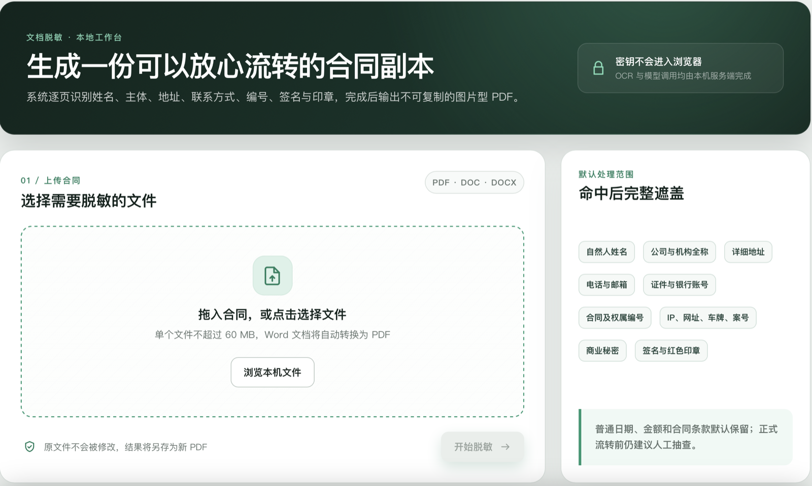

# Contract Redactor

Contract Redactor 是一个面向中文合同的自动脱敏工具。它将 PDF、DOC、DOCX 合同统一转换为页面图像，识别需要保护的文字和视觉区域，以黑色像素覆盖命中内容，最终生成不可复制、无法通过移除标注恢复原文的图片型 PDF。



## 项目目的

合同在审核、教学、案例讨论或对外流转前，通常需要隐藏自然人、交易主体、联系方式、证件编号、签名和印章等信息。本项目把法律场景中的信息判断转化为可执行的识别规则，并结合 OCR、语言模型和图像检测完成自动遮盖，减少人工逐页检查和绘制黑框的工作量。

系统默认保留普通日期、金额和合同条款，使脱敏副本仍具备阅读和审核价值。自动处理结果适合作为辅助工具，正式流转前仍建议人工抽查。

## 技术方案

1. **文档标准化**：使用 LibreOffice 将 Word 文档转换为 PDF，再由 PyMuPDF 以 200 DPI 将每页渲染为图像。
2. **全文 OCR**：调用火山引擎 AI MediaKit OCR，获取页面文字、行结构和文字坐标。
3. **规则识别**：通过正则规则识别电话、邮箱、证件号、银行账号、网址、IP、车牌、案号及长编号。
4. **语义识别**：调用火山方舟 DeepSeek，判断自然人姓名、公司或机构全称、详细地址及商业秘密等上下文信息。
5. **视觉区域检测**：结合颜色和版面结构识别红色印章，以及冒号、横线、表格等结构后的签名区域。
6. **像素级遮盖**：根据 OCR 坐标将文字、签名和印章写入黑色像素，重新生成仅保留页面图像的 PDF。

后端使用 FastAPI，前端使用原生 HTML、CSS 和 JavaScript，支持任务进度、结果预览和文件下载。

## 默认覆盖信息

| 类别 | 示例 |
| --- | --- |
| 自然人信息 | 姓名、手机号、邮箱、身份证号及其他证件号码 |
| 主体信息 | 公司、机构及其他交易主体全称 |
| 地址信息 | 住所、通讯地址、经营地址等详细地址 |
| 账户信息 | 银行账号、银行卡号及带字段标签的账号 |
| 可识别编号 | 合同编号、权属证明编号、从业编号、案号及长数字或字母数字代码 |
| 网络与车辆信息 | IP 地址、网址、车牌号 |
| 视觉敏感区域 | 手写签名、签字区域、红色印章 |
| 其他敏感内容 | 由上下文识别出的商业秘密或特定敏感信息 |

## 本地运行

要求 Python 3.11 或更高版本。处理 DOC、DOCX 时还需要安装 LibreOffice。

```bash
python -m venv .venv
source .venv/bin/activate
pip install -r requirements.txt
cp .env.example .env
```

在 `.env` 中填写 AI MediaKit OCR 和火山方舟配置，然后启动服务：

```bash
uvicorn app.api:app --host 127.0.0.1 --port 8000
```

浏览器访问 `http://127.0.0.1:8000/`。服务器部署可参考 [DEPLOYMENT.md](DEPLOYMENT.md)。

## 数据与密钥

`.env`、合同原件、OCR 中间图片和脱敏结果均已加入 Git 忽略规则。API Key 仅由后端读取，不会写入浏览器页面。请勿将真实合同或密钥提交到公开仓库。

## 开源协议

本项目采用 [MIT License](LICENSE)。
